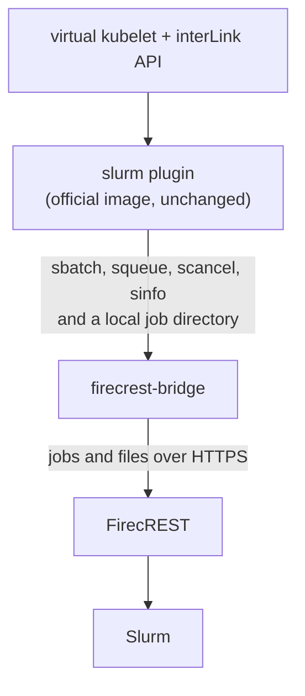

# interLink FirecREST plugin

Run [interLink](https://github.com/interlink-hq/interLink) pods on an HPC
cluster that is reachable only through [FirecREST v2](https://eth-cscs.github.io/firecrest-v2/),
such as CSCS Alps: no SSH, no shared filesystem.

It does not reimplement the pod-to-Slurm translation. The official
[interLink slurm plugin](https://github.com/interlink-hq/interlink-slurm-plugin)
runs unchanged, and `firecrest-bridge` gives it what it expects from a login
node: the Slurm commands and a job directory that the job can see.



## How it works

- **Shims.** The bridge binary, invoked as `sbatch`, `squeue`, `scancel` or
  `sinfo`, forwards the call to the daemon. The daemon answers through
  FirecREST and prints what Slurm 24.11 prints for the same arguments, so the
  plugin parses it as usual.
- **Staging.** `sbatch <dir>/job.slurm` uploads the job directory the plugin
  wrote (scripts, env files, volume content, empty dirs) to the same absolute
  path on the cluster, then submits the script.
- **Pulling back.** Every `SyncInterval` the daemon pulls the files the plugin
  reads from running jobs: logs (only the new tail), container and probe
  status files, and `compute-node`. Anything else the job leaves in its
  directory, such as an imported enroot image, stays on the cluster. Files are
  written in place, so a followed log keeps streaming. A terminal state is
  reported only after a final pull, so the plugin finds the container exit
  codes. Pending jobs are not polled.
- **Cleanup.** When the plugin removes a job directory, the bridge removes the
  remote copy. Nothing outside `JobRoot` is ever removed, and nothing at all
  while `JobRoot` itself is missing.
- **Restarts.** On start the daemon picks up running jobs from the plugin's
  `JobID.jid` files.

## Status

Tested against FirecREST's own demo stack (FirecREST 2.6, Slurm 24.11, Keycloak)
with the official slurm plugin `0.6.3-pre2` and interLink `0.6.3-pre2`:

- `test/integration/run.sh`, 33 checks: create, status, `nodeName`, logs,
  followed logs across a bridge restart, exit codes, ConfigMap, env and
  emptyDir volumes, delete of finished and running jobs with remote cleanup,
  and the same flow with the enroot runtime (Apptainer otherwise).
- `test/e2e/run.sh`, 10 checks: the virtual node is installed in kind with
  `helm install` of the interLink chart `0.6.2-pre5`, the bridge coming in
  through the chart's `extraContainers`; a pod applied with `kubectl` runs on
  the FirecREST cluster, and `kubectl logs` and `kubectl delete` work.

Not yet run against CSCS.

CI (`.github/workflows/`) runs on every pull request and push to `main`:
`ci.yaml` runs golangci-lint, `go vet` and the unit tests, and builds the
bridge image for amd64 and arm64 without pushing it; `e2e.yaml` runs both
scripts above on a GitHub runner. Publishing a GitHub release tagged `X.Y.Z`
runs `release.yaml`, which pushes
`registry.cern.ch/interlink/firecrest-bridge:X.Y.Z` with the `HARBOR_USERNAME`
and `HARBOR_PASSWORD` secrets of the `harbor` environment.

## Try it locally

Needs docker (with compose), kind, helm, kubectl, jq and Go 1.26.

```bash
make test                     # unit tests
make image                    # firecrest-bridge:dev
test/integration/run.sh       # FirecREST demo stack + plugin + bridge, then the scenarios
test/e2e/run.sh               # kind + helm install of the interLink chart with the bridge
test/e2e/run.sh down; test/integration/run.sh down
```

The e2e test installs the released chart (`CHART_VERSION`, default
`0.6.2-pre5`); `CHART=/path/to/interlink-helm-chart/interlink` tests a local
checkout instead.

`test/integration/run.sh` clones `eth-cscs/firecrest-v2` at a pinned commit
into `~/.cache/firecrest-bridge`, adds Apptainer and enroot to its demo Slurm
node, and leaves out MinIO, PBS and the SSH CA (not needed). The kind test
uses `kindest/node:v1.34.3`, the last image whose kubelet starts on cgroup v1
hosts, where it also switches the kubelet to the cgroupfs driver.

## Deploying

One `helm install` of the interLink chart (0.6.2-pre5 or later) deploys the
virtual kubelet, the interLink API and the slurm plugin, with the bridge added
through the chart's `extraInitContainers` and `extraContainers`. Fill the
`<...>` in `deploy/cscs/values.yaml`, then:

```bash
kubectl create namespace interlink-cscs
kubectl -n interlink-cscs create secret generic firecrest-client --from-literal=client-secret='<client secret>'
helm install cscs -n interlink-cscs -f deploy/cscs/values.yaml \
  https://github.com/interlink-hq/interlink-helm-chart/releases/download/interlink-0.6.2-pre5/interlink-0.6.2-pre5.tgz
```

`deploy/cscs/README.md` has the pod layout and the remaining steps.

The bridge reads its settings from a file (`daemon --config FirecrestConfig.yaml`)
or, as in `deploy/cscs/`, from the environment (`daemon --config ''`):

| Key | Environment | Default | Meaning |
|---|---|---|---|
| `FirecrestURL`, `System` | `FIRECREST_URL`, `FIRECREST_SYSTEM` | | FirecREST v2 base URL and cluster name |
| `TokenURL`, `ClientID`, `ClientSecret` | `FIRECREST_TOKEN_URL`, `FIRECREST_CLIENT_ID`, `FIRECREST_CLIENT_SECRET` | | OAuth2 client credentials, refreshed before they expire |
| `APIKey` | `FIRECREST_API_KEY` | | CSCS service-account key, instead of client credentials |
| `Account` | `FIRECREST_ACCOUNT` | | passed to every submission |
| `JobRoot` | `FIRECREST_JOB_ROOT` | | the plugin's `DataRootFolder`, same absolute path in the pod and on the cluster |
| `Socket` | `FIRECREST_BRIDGE_SOCKET` | `/var/run/firecrest-bridge/bridge.sock` | where the shims connect |
| `SyncInterval` | | `5s` | how often running jobs are pulled |

`ClientSecretFile` and `APIKeyFile` read the secrets from files; `FinalSyncRounds`,
`PingTTL`, `UploadParallelism`, `MaxUploadSize` and `RequestTimeout` tune the rest
(see `pkg/bridge/config.go`).

## Limitations

- **No network tunnels.** interLink's wstunnel, mesh and SSH shadow modes need
  either a public endpoint on the Kubernetes side or SSH to the cluster.
  Alps compute nodes are on private addresses behind NAT, so reaching a pod's
  ports needs a rendezvous both sides can dial out to. Not implemented.
- **Files above 5 MiB** cannot be staged at submission: FirecREST's S3 transfer
  path is not implemented. Scripts, env files and ConfigMaps are far below it.
- **Logs lag** by up to `SyncInterval`.
- **One identity.** Every job runs as the owner of the FirecREST client.
- The `slurm-job.vk.io/job-workdir` annotation must point below `JobRoot`.
- With `ContainerRuntime: enroot`, the slurm plugin (`0.6.3-pre2`) mounts the
  env file over `/etc/environment`, which enroot 4.2 does not load: pod env
  vars do not reach the container. A plugin issue, independent of the bridge.
- Only the `squeue`, `sinfo` and `scancel` invocations the plugin makes are
  emulated.
