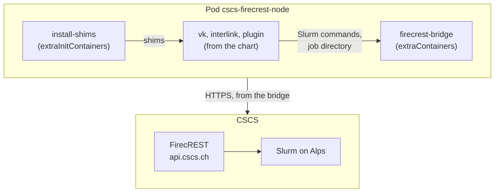

# Virtual node for CSCS (Alps) through FirecREST

A separate interLink virtual node, next to any others in the cluster, installed
with `helm install` from the upstream interLink chart (0.6.2-pre5 or later): the
chart's virtual kubelet, interLink API and official slurm plugin, with the
bridge added through the chart's `extraContainers` and `extraInitContainers`.
Nothing here uses SSH: the only connection is HTTPS from the bridge to
`api.cscs.ch` and `auth.cscs.ch`.



## Before you start

- A FirecREST client from the CSCS Developer Portal (client id and secret). Jobs
  run as the user who owns it.
- A project with compute time on the target system, for `FIRECREST_ACCOUNT`.
- Outbound HTTPS from the cluster to `api.cscs.ch` and `auth.cscs.ch`.

## Deploy

1. Fill every `<...>` in `values.yaml`. The job root path appears four times
   (`DataRootFolder`, `FIRECREST_JOB_ROOT` and the two `jobs` mounts) and must
   be identical in all of them.
2. Create the namespace and the Secret with the client secret, the only object
   the chart does not create:

   ```bash
   kubectl create namespace interlink-cscs
   kubectl -n interlink-cscs create secret generic firecrest-client \
     --from-literal=client-secret='<client secret>'
   ```

3. Install:

   ```bash
   helm install cscs -n interlink-cscs -f values.yaml \
     https://github.com/interlink-hq/interlink-helm-chart/releases/download/interlink-0.6.2-pre5/interlink-0.6.2-pre5.tgz
   ```

   If helm stops at "no cached repo found" for one of your configured
   repositories, run `helm repo update` or prefix the command with
   `HELM_REPOSITORY_CONFIG=/dev/null`.

4. Approve the virtual kubelet's serving certificate, which `kubectl logs`
   needs (it asks again on every restart):

   ```bash
   kubectl get csr | grep cscs-firecrest
   kubectl certificate approve <csr name>
   ```

## Run a pod there

```yaml
spec:
  nodeSelector:
    kubernetes.io/hostname: cscs-firecrest
  tolerations:
    - key: virtual-node.interlink/no-schedule
      operator: Exists
```

## Known limits

- With `ContainerRuntime: enroot` the slurm plugin (`0.6.3-pre2`) mounts the
  pod's env file over `/etc/environment`, which enroot does not load: pod env
  vars do not reach the container.
- No Services into the job: there is no network tunnel to Alps.
- Logs reach `kubectl logs` with up to 5 s delay (the bridge's sync interval).
